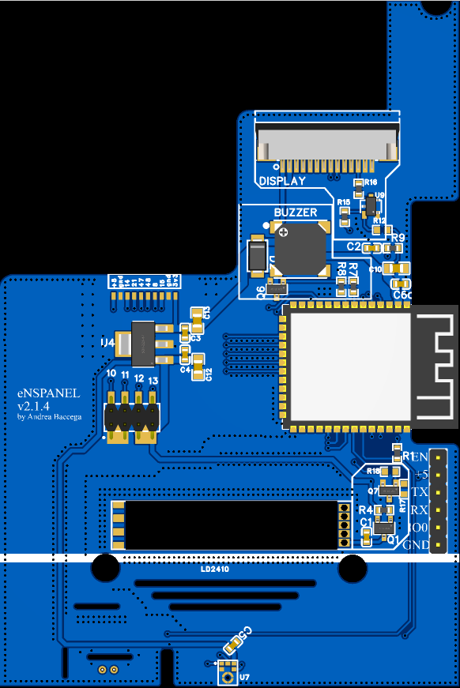

# eNSPanel

The Sonoff NSPanel US is a good looking touch panel that can be used to control your smart home devices. 

It features:

- a capacitive display,
- 2 physical buttons,
- a buzzer,
- 2 relays,
- WiFi & BT via esp32.

The original firmware did not fit my needs so I decided to create a custom firmware for it using ESPHome. How to do that is out of the scope of this repository.

## Why a new PCB?

The original PCB is great but I wanted to add some to add a few features:

- LD2410 presence detection sensor
- microphone for voice commands*
- ~ZigBee router*~ (removed in 1.4)
- an upgraded ESP32 module (ESP32-S3-WROOM-1-N16R8)

* Requires an S3 module with PSRAM (Ex: ESP32-S3-WROOM-1-N16R)

All of these features are optional and can be omitted if you don't need them.

Also, since many manifacturing companies **provide a big discount for PCBs that are 100x100mm or smaller**, I decided to make the PCB fit that dimensions.

## PCB compatibility

The new PCB is compatible with the original enclosure and the original display. The whole point of this project is to reuse the original enclosure and display.

Since 1.4 the PCB has been redesigned to fit a daughter board that could communicate with the main ESP32 via one or more of the provided 6 GPIOs.

If you need to slot the LD2410 presence sensor, then a 3d printed part is needed. The part is provided in the `3d` folder.

**Headers should not be soldered** if you want to use the original display. Either u press fit the pins or use some Pogo pin clamp like [this one](https://www.aliexpress.com/item/1005004869027755.html?spm=a2g0o.order_list.order_list_main.138.54f23696LNGlKo&gatewayAdapt=glo2ita).

## Assembly

As a first step I suggest to solder the ESP32 first along with C6, C10, C2, R9 (top right corner of the ESP32) along with the LDO(U4) and its capacitors.

After this step, it's whise to flash the ESP32 using the bottom right header with the firmware and test it before soldering the rest of the components.

The rest of the components can be soldered in any order.

For the LD2410 sensor, the way I do it is the following:

- add some solder paste on the pads in the PCB
- place the sensor on the PCB
- heat up with a hot air gun until the sensor is soldered
- test with multimeter.

## ESPHome Firmware

With composability in mind, The firmware is split into different files to be "required". This allows you to easily import only the features you need.
