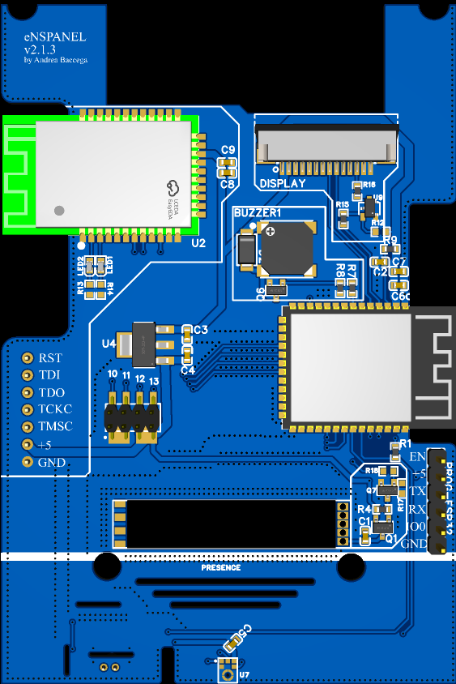

# eNSPanel

The Sonoff NSPanel US is a good looking touch panel that can be used to control your smart home devices. 

It features:

- a capacitive display,
- 2 physical buttons,
- a buzzer,
- 2 relays,
- WiFi & BT via esp32.

The original firmware did not fit my needs so I decided to create a custom firmware for it using ESPHome. How to do that is out of the scope of this repository.

## Why a new PCB?

The original PCB is great but I wanted to add some to add a few features:

- LD2410 presence detection sensor
- microphone for voice commands
- ZigBee router*
- an upgraded ESP32 module

All of these features are optional and can be omitted if you don't need them.

Also, since many manifacturing companies **provide a big discount for PCBs that are 100x100mm or smaller**, I decided to make the PCB fit that dimensions.

## PCB compatibility

The new PCB is compatible with the original enclosure and the original display. The whole point of this project is to reuse the original enclosure and display.

If you don't need ZigBee, you can just not solder the ZigBee module and the PCB will work just fine. Macro components/functionalities are marked with silkscreen to ease finding the related componentes on the PCB.

**Headers should not be soldered** if you want to use the original display. Either u press fit the pins or use some Pogo pin clamp like [this one](https://www.aliexpress.com/item/1005004869027755.html?spm=a2g0o.order_list.order_list_main.138.54f23696LNGlKo&gatewayAdapt=glo2ita).

## ESPHome Firmware

With composability in mind, The firmware is split into different files to be "required"
