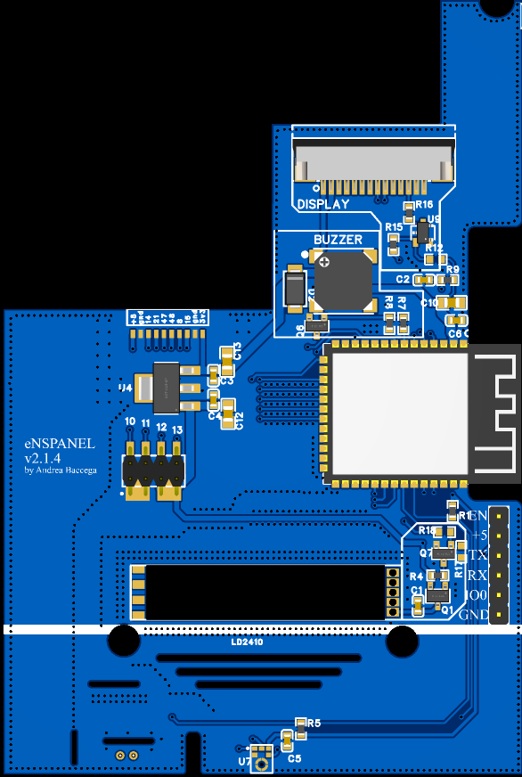

# eNSPanel

The Sonoff NSPanel US is a good looking touch panel that can be used to control your smart home devices. 

It features:

- a capacitive display,
- 2 physical buttons,
- a buzzer,
- 2 relays,
- WiFi & BT via esp32.
- No more issues in flashing the display

The original firmware did not fit my needs so I decided to create a custom firmware for it using ESPHome. How to do that is out of the scope of this repository.

## Why a new PCB?

The original PCB is great but I wanted to add some to add a few features:

- LD2410 presence detection sensor
- microphone for voice commands `*`
- ~ZigBee router*~ (removed in v2.1.4)
- an upgraded ESP32 module (ESP32-S3-WROOM-1-N16R8)

`*` Requires an S3 module with PSRAM (Ex: ESP32-S3-WROOM-1-N16R)

All of these features are optional and can be omitted if you don't need them.

Also, since many manifacturing companies **provide a big discount for PCBs that are 100x100mm or smaller**, I decided to make the PCB fit that dimensions.

## I want it... tell me more!

The documentation is quite extensive and can be found in the [docs](docs) folder or in the [website](https://enspanel-docs.andreabaccega.com/).
