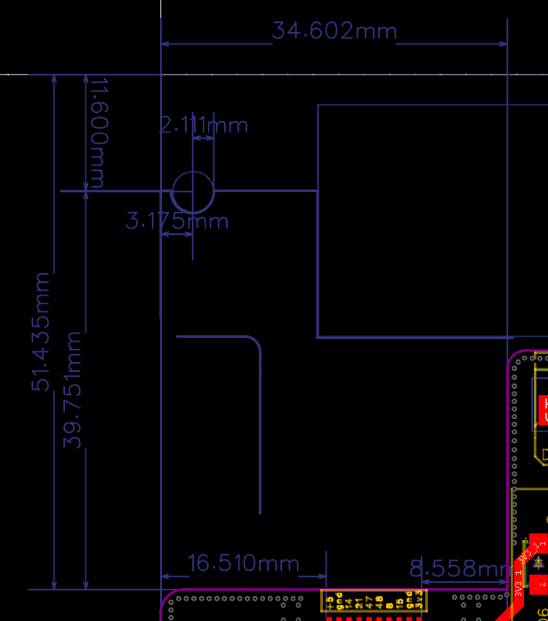

# Daughter Boards

The first big noticeable difference between the original PCB and the new one is the presence of a daughter board. The idea behind this is to have a main PCB that can be used for different purposes. For example, you could design a daughter board with a ZigBee module, or a daughter board with a speaker, or a daughter board with a sensor. The possibilities are endless.

The main PCB has 6 GPIOs that can be used to communicate with the daughter board. The daughter board can be powered by the main PCB... Both +5V and +3.3V are available on the daughter board.

Daughter/mother connection can be done via the [BC075-10-A-L-A](https://www.mouser.it/ProductDetail/GCT/BC075-10-A-L-A) connector (if soldered) or wires could be hand-soldered to the 1mm pitch pads on the main PCB.

For example, you could design a daughter board with a ZigBee module, or a daughter board with a speaker, or a daughter board with a sensor. The possibilities are endless.

The main PCB has 6 GPIOs that can be used to communicate with the daughter board. 

## Connector

Daughter/mother connection can be done via the [BC075-10-A-L-A](https://www.mouser.it/ProductDetail/GCT/BC075-10-A-L-A) connector (if soldered) or wires could be hand-soldered to the 1mm pitch pads on the main PCB.

From left to right here the 10 pins:

1. +5V
2. GND
3. IO14
4. IO21
5. IO47
6. IO48
7. IO8
8. IO16
9. GND
10. 3.3V

## Designing a Daughter Board

The daughter board can be designed in any way you like. But there are dimension constraints.

Constraints:

- max 34.6x51.4mm
- max 1.6mm thickness
- 1mm pitch for the connector
- at least 16.51 mm clearance from first connector pad to the edge of the board
- at least 8.5 mm clearance from the last connector pad to the edge of the board

All measurements are shown below:

 
**NOTE**: Please **mind the hole** in the daughter board. The hole is there to allow the daughter board to be slotted in the enclosure. The hole is 2.1mm in radius and is centered at ~3.2mm from left edge and 11.6mm from the top edge.

**NOTE**: Having some clearance is always a good idea.

Also, in case you need to slot an **antenna**, please **use the leftmost edge of the daughter board**!
