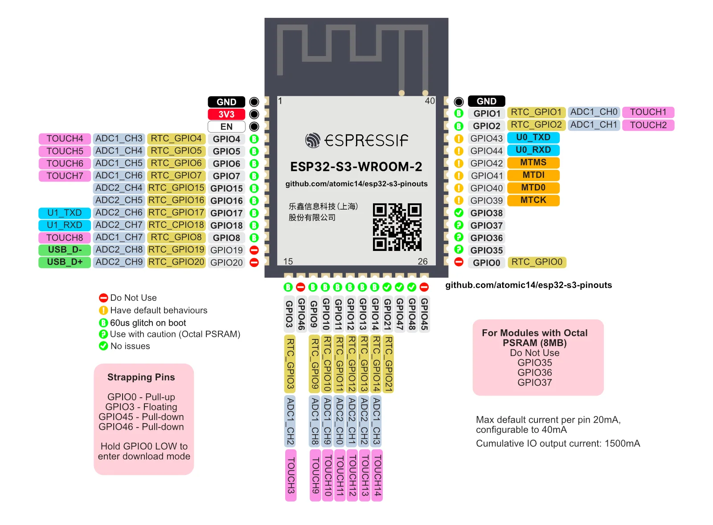

Here a GPIO table for the ESP32 module used in the PCB:

| GPIO | Function       | Description                                              |
|------|----------------|----------------------------------------------------------|
| 3    | Thermistor VCC | Switch to provide NTC thermistor VCC only when measuring |
| 4    | Display        | Display power on/off                                     |
| 5    | Display RX     | Display UART data line                                   |
| 6    | Display TX     | Display UART data line                                   |
| 7    | Buzzer         | Buzzer PWM                                               |
| 8    | Daughter       |                                                          |
| 9    | Thermistor ADC | Measurement PIN for the Thermistor                       |
| 10   | Header         | wired but not used                                       |
| 11   | Relay          | Relay #1                                                 |
| 12   | Relay          | Relay #2                                                 |
| 13   | Header         | wired but not used                                       |
| 14   | Daughter       |                                                          |
| 15   | Daughter       |                                                          |
| 16   | LD2410         | Presence sensor power cutoff                             |
| 17   | LD2410         | Presence sensor RX                                       |
| 18   | LD2410         | Presence sensor TX                                       |
| 35   | Microphone     | i2c mic WS                                               |
| 36   | Microphone     | i2c mic SD                                               |
| 37   | Microphone     | i2c mic SCK                                              |
| 38   | Microphone     | i2c mic SCK                                              |
| 41   | Switch         | right switch                                             |
| 42   | Switch         | left switch                                              |
| 21   | Daughter       |                                                          |
| 47   | Daughter       |                                                          |
| 48   | Daughter       |                                                          |

Basically all the useable GPIOs are being used. Some of them are being allocated for the daughter board. And 2 of them for the 2.0mm pitch header.

Here below a pinout reference taken from [`atomic14`'s repository](https://github.com/atomic14/esp32-s3-pinouts)

