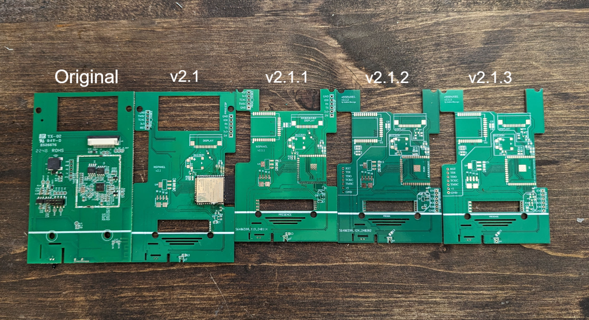

# Welcome to eNSPanel

For full documentation visit [here](https://enspanel-docs.andreabaccega.com/).

## Features

- [LD2410](modules/presence.md) presence sensor
- Low cost PCB production (dimensions <100x100mm)
- [Microphone](modules/microphone.md) for voice assistant
- [mother-daughter](daughter.md) pcb (to extend functionalities)
- enclosure compatibility `*`
- all the goodies from the NSPanel such as:
  1. capacitive display
  2. buzzer 
  3. 2 relays
  4. ...

`*` only if not slotting the LD2410. otherwise a 3d printed part is required.

## Why?

The NSPanel from SonOff is a great device. I have 8 in my home serving as thermostats and doing much more. Unfortunately their outdated hardware is quite limiting. 

For example one of the reason why the ESPHome version struggles in **uploading the TFT** to the Nextion panel is the lack of free memory.

Another reason why the NSPanel needed an upgrade was/is the **lack of other functionalities.** With edge AI and [wake-word recognition](microwakeword.md) inside the ESP32-S3 module you could really have a **smart voice assistant in each room** (like I have in my case).

Initially I also wanted to slot a ZigBee module that could also enhance my home ZigBee network but starting from v1.4 I decided that [mother-daughter](daughter.md) approach was the best to minimize costs and reduce waste.

For example one could design a daughter board with a small speaker to engage with the voice assistant... Want an **atmospheric sensor?** design a board for it. Not happy with the AI capabilities of the slotted ESP32-S3? you get the idea :)

## How?

Since the replacement board needed to be compatible with the original board, a 1:1 SVG has been created with relevant holes and dimentions.  

