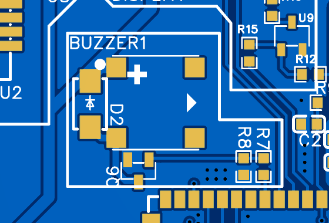

The capacitive Nextion display is what makes the NSPanel a good Home automation product.

## GPIO

In the original board the nextion display communicates with the esp32 via `IO16` & `IO17`. While on the eNSPanel `IO6` and `IO7` were used

## Configuration

Always refer to the `esphome` folder for the most up to date working configuration. This is a known to be working minimal configuration for the buzzer

```yaml

rtttl:
  id: buzzer
  output: buzzer_out

output:
  - platform: ledc
    id: buzzer_out
    pin:
      number: 7
```

## Part

Almost any `SMD,7.5x7.5mm` buzzer with an operating voltage of 3v3 should be working. For my boards I went with `MLT-7525`

## Soldering

Soldering the buzzer and the related parts (see below) should be pretty straightforward. Just mind both **the buzzer and the diode polarity**.
## Related Parts

All the parts related to the buzzer are containerd inside the silkscreen polygon marked as `BUZZER`.



Wish you to not slot the buzzer for whatever reason you can skip soldering all the components included in that region.
