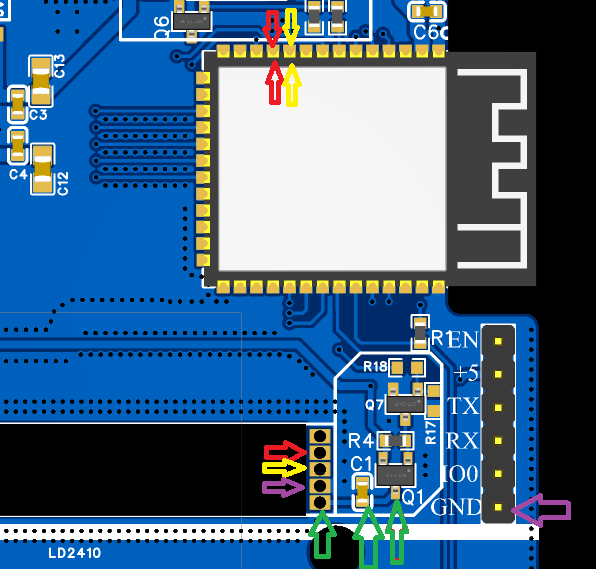

The LD2410 is a very well known and relatively inexpensive presence sensor.

Its speed, angle and capabilities make it a very versatile sensor. The main drawback is that it cannot be battery powered.
 
Thankfully we can power it via the main PCB. The sensor can be soldered on the main PCB. 

## Drawbacks of slotting the LD2410

Unfortunately due to the size of the sensor and its high frequency of operation, the sensor could not be placed in a more convenient location.

Furthermore, due to height limitations in the current enclosure, you will need to print a 3d part to replace the original one.

## LD2410 sensor soldering

Several iterations of the PCB were done to try to slot the LD2410 sensor without the need to change anything about the enclosure. Unfortunately, the sensor is too big to fit in the enclosure.

The best compromise was to have the sensor laying on top of the PCB. This way there is a semi-easy way to solder the LD2410 sensor.

To do that:

1. place the sensor on the PCB.
2. fill the pins with solder paste,
3. use your hot air gun.

### Testing with a multimeter

After soldering the sensor, it's a good idea to test it with a multimeter.

Testing continuity between the pins should give you a good idea if the sensor is soldered correctly. Just check out the following image.

**If you don't find continuity across the marked locations, then the sensor is not soldered correctly.**

## Accuracy behind the enclosure

The sensor is very accurate and can detect presence from a good distance.
For sure there is a tradeoff when using the sensor behind a plastic enclosure. The sensor is not as accurate as it would be if it was placed in an open space. But in my **non scientific** tests, the sensor does still serve its purpose.
