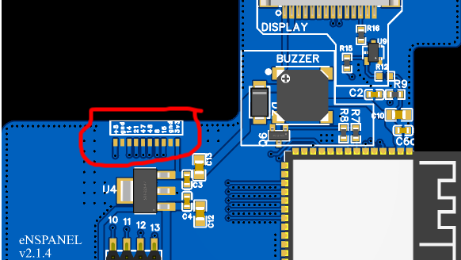

# PCB

This page describes the decisions I made to design PCB for the NSPanel. The PCB is designed to fit the original enclosure and the original display.

## Mother/Daughter

The first big noticeable difference between the original PCB and the new one is the presence of a daughter board. The idea behind this is to have a main PCB that can be used for different purposes. For example, you could design a daughter board with a ZigBee module, or a daughter board with a speaker, or a daughter board with a sensor. The possibilities are endless.

The main PCB has 6 GPIOs that can be used to communicate with the daughter board. The daughter board can be powered by the main PCB... Both +5V and +3.3V are available on the daughter board.

Daughter/mother connection can be done via the [BC075-10-A-L-A](https://www.mouser.it/ProductDetail/GCT/BC075-10-A-L-A) connector (if soldered) or wires could be hand-soldered to the 1mm pitch pads on the main PCB.

More info on the daughter board can be found [here](/daughter).

## LD2410 sensor

As explained in the [soldering](/soldering) page, the LD2410 sensor is too big to fit in the enclosure. The best compromise was to have the sensor laying on top of the PCB.
