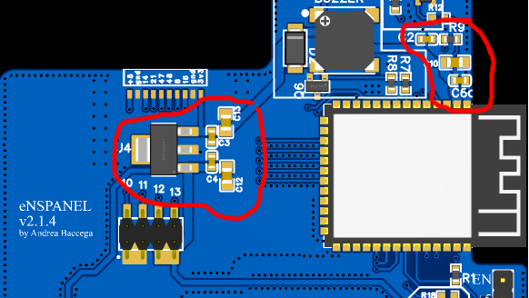

# Soldering

First component that needs to be soldered is the **ESP32**. This makes the first flashing super easy.

## ESP32 Soldering

A bare minimal component soldering includes:
- R9 (0603 10kΩ)
- C6, C2, C4, C3 (0603 100nF)
- C10, C12, C13 (0805 22uF)
- LDO (U4)

The components are circled here:

 
After soldering the ESP32, the LDO and the capacitors, the ESP32 can be flashed using the bottom right header. 

